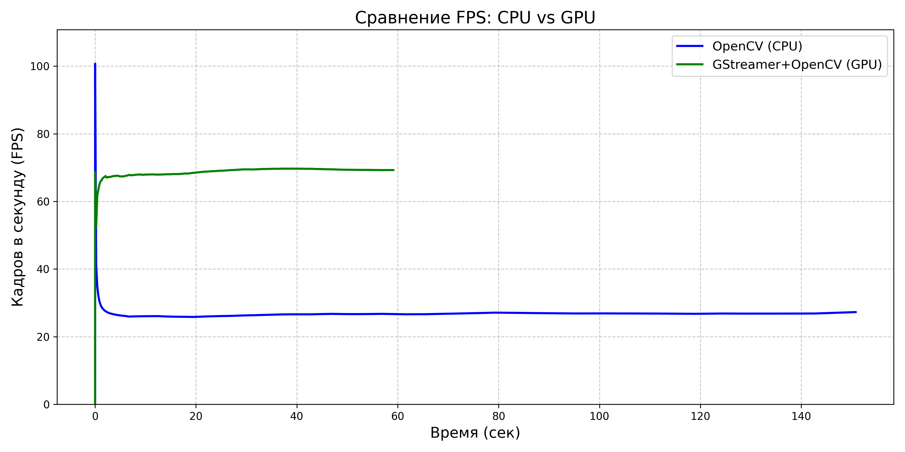
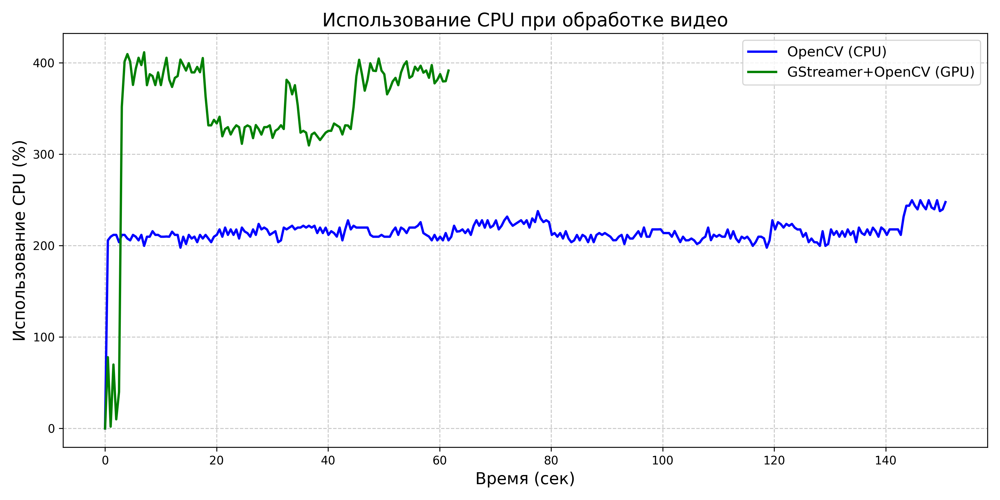
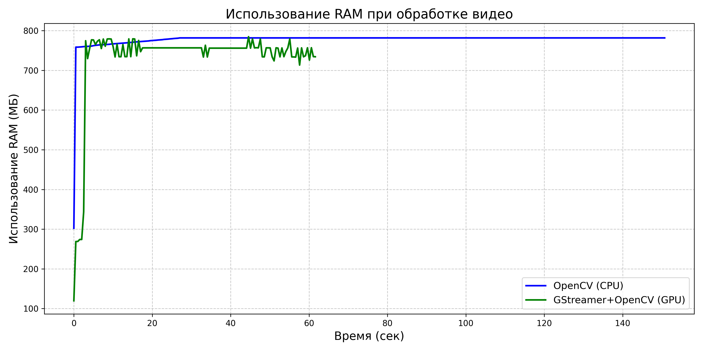

# Оптимизация видеопотоков с GPU-ускорением для CV-моделей

## 1. Зачем оптимизировать обработку видео?

При разработке системы inference для моделей компьютерного зрения с одновременной обработкой нескольких видеопотоков обычный OpenCV на CPU становится серьезным узким местом. Для работы в режиме реального времени, когда необходимо декодировать видео, применить несколько моделей и снова закодировать результат, производительности CPU часто недостаточно.

Связка GStreamer + OpenCV + GPU предоставляет критические преимущества для высоконагруженных продакшн-систем:
- Аппаратное ускорение декодирования и кодирования видео сокращает задержки на 60-70%
- Освобождает CPU для задач анализа и логики, когда GPU занимается видеопотоками
- Масштабируемость для одновременной обработки десятков потоков на одном сервере
- Снижение энергопотребления при той же нагрузке, что особенно важно для edge-устройств

Для сервисов видеоаналитики с моделями компьютерного зрения GPU-ускорение является не просто оптимизацией, а необходимым компонентом архитектуры, обеспечивающим работу в режиме реального времени.

## 2. Требования к железу: сравнение технологий аппаратного ускорения

Современные решения для аппаратного ускорения видео представлены тремя основными экосистемами:

| Технология | Производительность (1080p) | Поддерживаемые кодеки | Преимущества | Недостатки |
|------------|----------------------------|------------------------|--------------|------------|
| **NVIDIA NVENC/NVDEC** | 120-300 FPS | H.264, H.265, VP8, VP9, AV1* | Высокая производительность, интеграция с CUDA/TensorRT, поддержка batching | Требуются дорогие GPU, закрытые драйверы |
| **Intel Quick Sync Video** | 90-200 FPS | H.264, H.265, VP9, AV1* | Встроен в большинство CPU от Intel, низкое энергопотребление | Ограниченная производительность, меньше опций контроля качества |
| **AMD VCN/AMF** | 80-180 FPS | H.264, H.265, AV1* | Хорошее соотношение цена/качество, открытые драйверы (частично) | Менее зрелая экосистема инструментов, ограниченная поддержка в OpenCV |

*Поддержка AV1 только в новейших версиях оборудования

**Рекомендации по выбору железа:**
- Для серверных решений: NVIDIA RTX серии A/T с большим объемом VRAM
- Для edge-устройств: NVIDIA Jetson или Intel NUC с Iris Xe Graphics
- Для бюджетных решений: AMD APU или Intel CPU с интегрированной графикой

## 3. Программные инструменты для работы с видео

| Инструмент | Возможности | Преимущества | Недостатки |
|------------|-------------|--------------|------------|
| **OpenCV** | Общие операции с видео, интеграция с моделями CV | Простой API, обширная документация, готовые алгоритмы CV | Базовая версия без аппаратного ускорения |
| **GStreamer** | Полноценные видеопайплайны, декодирование/кодирование | Модульность, высокая производительность, гибкость настройки | Сложный API, крутая кривая обучения |
| **FFmpeg** | Универсальный инструмент для работы с медиа | Поддержка всех форматов, высокая производительность, CLI | Сложная интеграция с Python, меньше опций для CV |
| **MediaPipe** | Готовые пайплайны для типичных задач CV | Оптимизированные графы обработки, кросс-платформенность | Меньше контроля над отдельными компонентами |

GStreamer особенно хорошо подходит для создания комплексных видеопайплайнов с GPU-ускорением и легко интегрируется с OpenCV, что делает его оптимальным выбором для задач компьютерного зрения.

## 4. Установка и настройка

Сборка OpenCV с поддержкой GStreamer и CUDA/NVENC требует точной настройки под конкретную архитектуру GPU, версию драйверов и ОС. Это нетривиальная задача из-за множества зависимостей и опций конфигурации, особенно для продакшн-систем.

Подробная инструкция по установке и настройке доступна в нашем  
[руководстве по  README_install.md](./README_install.md)  

Так-же возможна установка в docker

## 5. Результаты экспериментов: CPU vs GPU

Для проверки эффективности GPU-ускорения был разработан бенчмарк, сравнивающий производительность OpenCV на CPU (`process_video_cpu`) и OpenCV+GStreamer с GPU-ускорением (`process_video_gpu`). Эксперимент включал декодирование, простую обработку (размытие Гаусса) и повторное кодирование видео.

После того как OpenCV собран и установлен правильно с gstreamer, CUDA nvenc nvdec можно запустить:
1) Banchmark  OpenCV+GStreamer (GPU) vs OpenCV (CPU)  
[01_opencv-gstreamer-benchmark.py](./examples/01_opencv-gstreamer-benchmark.py)  
2) Тестовый скрипт видео декодинг->энкодинг запись в файл с помощью OpenCV+GStreamer  
[02_simple_decode_encode.py](./examples/02_simple_decode_encode.py)  

**Результаты:**

| Метрика | OpenCV (CPU) | GStreamer+OpenCV (GPU) |
|---------|-------------|------------------------|
| Средний FPS | 27.27 | 69.26 |
| Размер файла (МБ) | 142.13 | 365.19 |
| Время обработки (сек) | 150.80 | 59.24 |
| Среднее использование RAM (МБ) | 778.06 | 730.69 |
| Среднее использование CPU (%) | 214.57 | 346.73 |

**Ключевые наблюдения:**
- GPU-ускорение обеспечило увеличение производительности в 2.54 раза
- Общее время обработки сократилось на 61%
- Несмотря на более высокую загрузку CPU при работе с GPU, фактическое время обработки значительно меньше
- Размер выходного файла при GPU-обработке больше из-за настроек качества по умолчанию

## 6. Выводы и рекомендации

Для разработчиков систем компьютерного зрения, работающих в режиме реального времени:

1. Всегда используйте аппаратное ускорение для кодирования/декодирования видео — это дает 2-3х кратный прирост производительности без потери качества.

2. Предпочитайте модульные пайплайны GStreamer, которые позволяют изолировать процессы декодирования, обработки и кодирования, делая систему более гибкой и устойчивой к ошибкам.

3. Избегайте перемещения данных между CPU и GPU — старайтесь выполнять всю обработку на GPU, включая предварительную обработку изображений перед применением моделей.

4. Для многопоточных систем критически важна правильная балансировка нагрузки между декодированием/кодированием и инференсом моделей — оптимально использовать разные GPU для этих задач или выделять фиксированные ресурсы на одном мощном GPU.

5. При проектировании архитектуры закладывайте производительность с запасом — даже современные GPU могут становиться узким местом при одновременной работе с 10+ потоками высокого разрешения.
